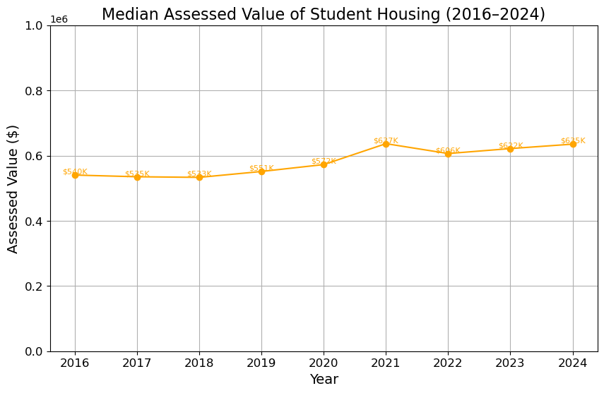

# CS506_project (https://www.youtube.com/watch?v=QPIXDBgT4HM)

> **!!!Structure of this report:!!!** We are going to split this report by questions we have answered. With each section, we will talk about the data processing/cleaning, models used, analysis, and preliminary results for each question we have solved. This is primarily to make the report more easy to follow.

### Description of Project ###

As a young student finding your first off-campus housing is quite a daunting challenge and with Warren Towers under renovation, we take this opportunity to analyze and inform on the transparency and accountability of off-campus student housing. Through this project, we seek to first find a cluster of locations with dense student populations to allow us to study the condition under which students are allowed to pursue their education. The project will progress under a collaborative environment with the Inspectional Services Department to restore and clarify housing violation data, develop tools to identify problematic landlords, and integrate data across city departments. 

### Goal of Porject ###

Under the BuSpark ensign, this projects seeks to be rich in information extraction, pattern recogniztion, and, most importatnly, a helpful tool in guiding students to make more informative decsions on housing contracts. 


# FINAL REPORT


This project came with questions and goals that we are trying to solve using data given. We have successfully answered the 5 base questions, we have also expanded on such questions. This report is going to follow the questions in the order listed below. The questions we have analyzed include:
1.  What are the housing conditions for students living off-campus? (e.g. how many students per unit) Is the unit managed by a “bad landlord’ (e.g. how many building violations have student housing)
2. What are the trends regarding student housing across the city, by district, e.g. what % of the rental housing is taken up by students for each district and how has this changed over time?
3. What types of violations are happening at each Ward/ most violations for each ward?
4. What are the risk-scores for each Ward (Scofflaw violations average of each ward)
5. How has the value of these off campus housing options changed over time?
6. What is the spectrum of violations and severity in regards to worst landlords classifications?
7. What landlords are non-compliant? Overall volume, severe violations.


The datasets that this midterm report is going to focus on include: 
- 311 Service Request of Boston (https://data.boston.gov/dataset/311-service-requests)
- SAM Addresses (https://data.boston.gov/dataset/live-street-address-management-sam-addresses)
- Property Assessment data (https://data.boston.gov/dataset/property-assessment)
- Shape file for neighborhoods (https://data.boston.gov/dataset/boston-neighborhood-boundaries-approximated-by-2020-census-tracts)
- Student Housing Survey (2016-2024) (https://docs.google.com/spreadsheets/d/11X4VvywkSodvvTk5kkQH7gtNPGovCgBq/edit?gid=1139465182#gid=1139465182)
- Building and Violation Data (https://data.boston.gov/dataset/building-and-property-violations1/resource/800a2663-1d6a-46e7-9356-bedb70f5332c)
- Boston Latitude and Longitude Map provided by MassGIS (publicly available at https://massgis.maps.arcgis.com/apps/View/index.html?appid=530eb45188934e23a8703399fd37bf0f)


# Makefile

Given the line of code below, you should have access to all the dependencies needed within our code for this project.

``` 
pip install numpy pandas matplotlib scikit-learn contextily seaborn
```


## Question 1: What are the housing conditions for students living off-campus? Is the unit managed by a “bad landlord’?

All of the data used in this report came from this document. https://docs.google.com/document/d/1bo8HOm5KWv1h1UqtTZ7QCV4YYtyfKhN9KFHLL5j0MJo/edit?tab=t.0. Most of the  the data is provided by Analyze Boston, the City of Boston's open data hub. The rest of the data is found publicly online at Master Address Database Data MassGIS (https://massgis.maps.arcgis.com/apps/View/index.html?appid=530eb45188934e23a8703399fd37bf0f)

### Data Processing (Q1) 

a. Cleaning and integration: Student Housing Survey and Building Violation Data

  1. Data Cleaning: Dropped rows that are not needed.
  
  2. Address Normalization: We standardized address entries (street names, zip codes) to merge the Student Housing Survey with the Building and Violation Data. The goal is to combine both data and run K-means clustering algorithm.
     - The student dataset had confusing column names like '6a. street #' and '6b. street name'. These were renamed for clarity: street_number,street_name, street_suffix, unit_number, zip_code
     - We padded all ZIP codes to 5 digits using zfill(5) to ensure consistency of the student data with the violation data.
     - We cleaned key address fields in both datasets to ensure consistent formatting:
       + Stripped whitespace
       + Converted to uppercase
       + Removed letters from street numbers (e.g., 116H → 116)
       + Replaced missing/invalid values with blanks
 
  3.  Data Grouping: We grouped both datasets by simple address key (using street number, streetname, and zip_code, concatenated with spaces) to count:
      - student_count: how many students reported each address
      - violation_count: how many violations were tied to each address
        
  4. Data Merging: After cleaning, the Student Housing Survey was linked to the Building and Violation Data based on address. This step allowed us to explore how many students occupied a given unit and how many violations were registered against the property.
 
  5. Data Filtering: We wanted to focus on problematic housing, so we filter the data by housing that has more than 0 violations.


### Data Analysis (Q1)
  
  1. Clustering: K-Means algorithm was applied with k = 5 (5 clusters), Features used: latitude, longitude, and ZIP code (normalized). The resulting clusters were plotted using a scatter plot of longitude vs latitude, color-coded by cluster. The results of the clustering can be seen below.
  
 


  2. Result and Interpretation:
     The clustering output revealed five distinct geographic regions where matched student and violation addresses are concentrated. Each color in the scatter plot represents a different cluster:

     - Cluster 0 (Blue): A relatively dispersed cluster centered around the middle region. This may represent a central urban zone with a diverse mix of matched addresses.

     - Cluster 1 (Orange):A very small and localized cluster. It may represent a particular housing complex or facility with concentrated matched violations.

     - Cluster 2 (Green):A tight grouping in the northwest. Indicates a neighborhood or district with a high density of student-related violations. Possibly a student residential area.

     - Cluster 3 (Red):A larger and well-formed cluster in the southern portion of the map. Suggests another major region of interest, likely with many matched cases.

     - Cluster 4 (Purple):A dense cluster in the northeast region. This may be associated with student-managed housing or large apartment buildings.
     
     The clustering visulization has not included the map of Boston neighborhood (that will be one of our next steps).

### Preliminary Results (Q1)


a. Results for Base question 2. 
  1. Distinct "Neighborhoods": Because we are clustering on latitude and longitude, the most obvious takeaway is that location is a primary driver of the clustering. This suggests that properties in each region may share similar characteristics—whether that’s proximity to campus, property age, or landlord ownership patterns. 

  2. Hotspots: Within the graph, cluster 2 and 4 are very closely dense with moderate to high number of violations and are considered hotspots. By searching up the coordinates, we were able to figure out that the two hotspot locations lie in Suffolk University (purple cluster) and Boston University (green cluster). This indicates that there exists a correlation between dense number of students and the number of violations. (More students dense together creates high ammount of violations).

  3. Coldspots: There are clusters on the graph that are less dense with less violations unlike cluster 2 and cluster 4. By looking at the latitude and longitude, it correlates with an area in Boston that are mostly residential (with some mix of student housing). Going along with point b, these points on the map show that there are less violations in areas where there are less student housing and more residential (further away from university). 


## Question 2:  What are the trends regarding student housing across the city, by district, e.g. what % of the rental housing is taken up by students for each district and how has this changed over time?

### Data Processing (Q2)
b. Cleaning and integration: MassGIS and Student Housing Survey (2016-2024)

  1. Data cleaning and filtering: We dropped colunns that are not needed in Student Housing Survey (Missing addresses, Nan values, etc). We filter out data by name and street number in order to filter out the data by district) 

  2. Address Normalization:
     - We standardized address entries (street names, zip codes, city, etc.) within Student Housing Survey since the addresses are sometimes not the same.
     - The student dataset did not include ward association to the address they were living in so we used hash mapping to get the ward names through anohter data set we found on the government website. 

  4. The address that were given were ranges of data. One part of the filtering process we did was to add another column (actual_address) where that column represents exactly one address making it easier to do location based analysis.
    
### Data Analysis (Q2)
b. Analysis for trends regarding student housing across the city, by district
     1.  Groups the DataFrame by ward and year, then counts the number of rows in each group (.size()). This count (student_units) effectively shows how many student rentals exist for each ward in each year.
     2. Trends over time: Iterates over each unique ward and plots a time series of student-occupied rentals (the student_units count) vs. year giving us the visuals to how students trends changes every year.
  

      
  

### Preliminary Results (Q2)

  1. From the Bar graph that is shown above, we can see a clear increase in students moving into rentals in Ward 21. When looking up Ward 21, we see that it's location is the Boston University area (see picture below). Given this analysis we are able to conclude that the rise of students is due to the nearby university (BU). The correlation does follow the hypothesis that neighborhoods in close proximity to universities have a far greater concentration of student renters.
     - Similarly, Wards 5 and 4, are amongst other popular areas that Boston University students would live in.
     - Several wards register below 500 student-occupied rentals in 2023 (Wards 2, 6, 12, 13, 15, etc.). This implies that these areas may not host many university campuses or may offer housing that’s less appealing—or less accessible—to students. We believe this areas to have potential for growth (if universities expand, etc.) Monitoring how these wards change over time, we could indicate trends such as improving public transportation routes.
   (image found on (https://www.cityofboston.gov/maps/pdfs/ward_and_precincts.pdf)

  2. Another trend that we discovered can be seen on the line graph above. Looking at the line graph, we see that there is a dip in student housing from the years 2019-2020. This directly aligns with the COVID-19 Pandemic where students were not as present during this time. Given the results, we are able to see how much of an effect students have on the properties around Universities. 


## Question 3: What types of violations are happening at each Ward/ most violations for each ward?

### Data Processing (Q3)

  1. `Data Cleaning and Preprocessing:`

      - We began by importing the property_and_building_violations.csv dataset, which contains violation case records across different wards.
      - We dropped rows where the violation description was missing (NaN) since these would not provide meaningful violation categorization.
      - We ensured all ward entries were clean by stripping whitespace and converting them to string format. Any non-numeric ward entries were filtered out, ensuring accurate aggregation.
  2. `Aggregation: ` We grouped the data by _violation_category_ and _ward_str_, counting the number of violations within each combination. Resulted in a clean summary DataFrame showing the number of violations per category per ward, which was then saved as _violation_counts_by_category_ward.csv_ for visualization.


## Data Analysis (Q3)
  1. `Text Normalization and Feature Extraction:`
      -  we preprocessed the `description` field by converting all text to lowercase for uniformity
      -  We then used **_CountVectorizer_** with an n-gram range of (3,3) to extract the most frequent trigrams across all violation descriptions, excluding common English stopwords.
      -  The resulting top 50 most common trigrams provided insight into recurring violation patterns and language used in violation reports. (as seen below)
     
        

  2. `Categorization of Violations:` To structure the analysis meaningfully, we created a function _**categorize_violation()**_ that classified each violation into broad categories based on keyword matching in the description. The categories include:

      - Permit Issues (e.g., missing permits, non-compliance)
      - Property Maintenance Issues (e.g., failure to maintain property)
      - Unsafe Conditions (e.g., dangerous, unsafe structures)
      - Electrical Violations (e.g., faulty wiring, electrical code issues)
      - Premise Violations (e.g., premises not up to code)
      - Certification Issues (e.g., missing certifications)
      - Water Violations (e.g., plumbing problems, water leaks)
      - Other (uncategorized issues)

  3. `Most Common Violation Types Across Wards:` we were able to identify which types of violations were most common in specific wards. An example is permit issues which we saw as a systemic problem amongst all wards. More about this below.

> CHECK OUT THE VISUALIZATIONS FOR THIS QUESTION HERE: https://public.flourish.studio/visualisation/22902450/


The picture above shows the correlation between ward number and area in Boston

## Preliminary Results (Q3)

  1. `Permit Issues dominate citywide:` Across basically all wards, the majority of violations were related to permit compliance, either due to failure to obtain proper permits for construction or not adhering to permit regulations. Given this trend, a solution we believe could be effective is to have more programs that educate people about permits and laws that are needed. This could be set up by the government or something. We believe that this permit issues is a systemic issues given that all wards have very high levels of permit violations.

       - Besides Permit issues that was the top category city wide, property maintenance issues ranked second.
  2. `Ward Specific Trends:` There are trends within certain wards that could be looked into more. We believe this is an area of focus and there is more information to be extracted if one were to understand housing violations and more about the area. Below are one of many trends that can be found given the graph. The violation groupings are able to be changed within the code `categorize_violation(desc):` 

      - Ward 3 (downtown) had a high concentration of Unsafe Conditions violations. This could be because of older building stock and more frequent building inspections in urban areas.
      - Ward 21, located around Boston University, had relatively more Property Maintenance Issues, likely due to the amount of student rentals and turnover rates every school year.
      - Ward 14 which we have done more research on is Mattapan. This area is known to have aging infatrsutcture this means that the are a lot of water related issues. The issues at Mattapan area inclues: lead in drinking water, combined sewer flows, etc. This is good because the data reflects such problems

# Question 4: What are the risk-scores for each Ward (Scofflaw violations average of each ward)? 

What this question aims to do is to figure out the scofflaw risk score for each ward. 'Scofflaw' is defined as a property that has: has property in active active enforcement proceedings (court) OR has 6+ violations on their rental properties. In a high level, what this question aims to do is to figure out which properties are under 'scofflaw' (1 for yes 0 for not under scofflaw) and we build a model trianing on such data to predict whether a property is a scofflaw based on engineered features.

## Data Processing (Q4)

1. Data Cleaning:
From the violations dataset, we selected the following columns:
   - `case_no:`  violation case number
   - `sam_id:` property ID reference
   - `status:` whether the case is open, closed, etc.
   - `status_dttm:` timestamp of the violation status update
   - `description:` text description of the violation 
From the SAM dataset, we selected:
   - `SAM_ADDRESS_ID:` matches sam_id
   - `FULL_ADDRESS:` text of their address
   - `created_date:` timestamp of address record creation
2. Processing:
   - Each violation description was normalized (uppercased) and classified into a specific category via a function _**categorize_violation(desc)**_. The categories are the same as the ones listed in Question 3.
   - `merging datasets:` The two datasets were merged using a left join on sam_id = SAM_ADDRESS_ID. This allowed violations to be tied back to their full addresses and address creation dates for better context.

## Data Analysis (Q4)

1. Feature Engineering - Given the dataset, we manually engineering multiple features per sam_id (property).
   - `total_violations:` Total number of recorded violations.
   - `days_since_last:` Number of days since the last violation was recorded.
   - `days_since_sam_created:` Number of days since the address was first created in the SAM system.
   - We created one counts for each violation category, e.g., how many times a property had a water violation, unsafe condition, etc.
   - any values that were missing were set to 0 for the purpose of the model
2. Creating the model:
   - We defined high-risk properties using two criteria: properties with 6 or more violations, or properties with at least one open case.
   - If either conditions were true, the property was labeled as a "scofflaw" (target = 1), otherwise as non scofflaw (target = 0).
   - `train-test split:` We split the dataset into training (80%) and testing (20%) with `random_state: 42`
   - `pipeline:` We created a scikit-learn Pipeline with _simpleImputer_ to fill missing values, _StandardScaler_ to normalize feature scales, and _RandomForestClassifier_ for classification.
3. Model trainning and prediction
   - The model was trained using `pipe.fit(X_train, y_train`) to predict whether a property is a scofflaw property.
   - After training, we predicted the probability using: `pipe.predict_proba(X)[:, 1]`
   - This value was saved into a new column called **_risk_score_**, representing the estimated risk level for each property on a 0 to 1 scale
4. We joined the score back with the following columns: `sam_id`, `total_violations`, `FULL_ADDRESS` which gave us the complete table that associates risk scores with the addresses.

> CHECK OUT THE VISUALIZATIONS FOR Q4 HERE: https://public.flourish.studio/visualisation/22902951/

## Preliminary Results (Q4)

Given the results from the visualization, we did a bit more research into the specific areas that had the highest scores, below are the some noteable results that we found:

1. Ward 10 (Risk Score: 0.39) -  Roxbury (closer to Nubian Square)

   - Has high concentration of a type of housing called triple decker houses. It also has a lot of older multi family housing areas and aging rental units. They apparently have issue with overcrowding and absent landowners/renters. We believe that the properties at Roxbury can be looked into more by experts to possibly resolve the what-looks-like systemic issues.
  
2. Ward 11 (Risk Score: 0.32) - Parts of Jamaica Plain and Roxbury
   - Ward 11 has similar problems to ward 10 as mentioned above. A lot of the housing here is very old but as of right now it's going through a lot of gentrification (from our research). Because of this, a lot of the older buildings are not paid close attention to compared to the newer buildings. We believe that this area is important to look into because we believe that in a few years the score will change a lot due to the area under going change.

3. Ward 2 (Risk Score: 0.18) - Charlestown

   - Out of all the wards in Boston, this area scored the lowest in terms of risk score. This area typically has a lot of single family homes and is considered the suburbs. It also has a lot of new devlopment (higher end) which we believe to be the reason why the maintenance culture is good around there. This development could definitely be looked at more in order to study and figure out why the risk score is so low. I think other areas could learn from this area.

# Question 5: How has the value of these off-campus housing options changed over time?

## Data Processing (Q5)

1. Cleaning and Integration: Student Housing Survey and Property Assessment Data

**Student Housing Cleaning**  
- Standardized column names (e.g., `6a. street #` → `StreetNumber`)  
- Uppercased and stripped whitespace from street names  
- Removed suffixes (e.g., “ST”, “AVE”) for matching  
- Padded ZIP codes to 5 digits using `.zfill(5)`  

**Property Assessment Cleaning**  
- Harmonized yearly schema changes (e.g., `AV_TOTAL` → `TOTAL_VALUE`)  
- Extracted numeric street numbers (e.g., `205A`, `134-136` → `205`, `134`)  
- Removed commas, dollar signs, and cast values to float  

**Merging**  
- Datasets were matched on address: `StreetNumber + StreetName + ZIP`  
- Only successfully matched rows were used to track value trends over time  

2. Value Preparation and Filtering

- Extracted and cleaned the `TOTAL_VALUE` field across all years  
- Dropped entries with missing or invalid assessed values  
- Prepared yearly subsets for modeling and visualization  

---

## Data Analysis (Q5)

1. Value Trend Analysis (2016–2024)

- Computed the **average** and **median** assessed value of matched student housing for each year  
- Created a dual-line plot to visualize year-over-year trends  
- Compared the median to the average to highlight skew  





2. Classification Model: Logistic Regression (2024)

- Defined **luxury housing** as units with assessed value > \$2,000,000  
- Selected features: `LAND_SF`, `LIVING_AREA`, `YR_BUILT`, `RES_UNITS`, `NUM_PARKING`  
- Trained a **logistic regression** classifier to predict luxury status  
- Evaluated using accuracy, precision, and recall  

**Model Results:**

| Metric     | Value     |
|------------|-----------|
| Accuracy   | 94.8%     |
| Precision  | 88.4%     |
| Recall     | 39.7%     |

**Feature Importance:**  
- `NUM_PARKING`: Strong positive coefficient (+0.85)  
- `RES_UNITS`: Strong negative coefficient (−3.68)  


3. ZIP Code-Level Summary

- Grouped properties by ZIP and computed the proportion of luxury units  
- Identified ZIP codes with the highest luxury student housing rates  

**Top ZIP Codes by Luxury Percentage:**

| ZIP     | Luxury % |
|---------|-----------|
| 02119   | 56.3%     |
| 02110   | 39.0%     |
| 02108   | 23.6%     |


---

## Result and Interpretation

- **Stable Averages, Rising Medians**: From 2016 to 2024, average student housing value remained between \$2.3M–\$2.6M, while the median increased steadily from \$540K to \$635K  
- **Luxury-Driven Skew**: The widening gap between median and mean reflects a small set of extremely high-value properties skewing the average  
- **Model Performance**: Logistic regression identified luxury housing with strong precision, though recall was limited due to class imbalance  
- **Geographic Patterns**: ZIP codes like 02119 (Roxbury) and 02110 (Downtown) had high concentrations of luxury units, showing location-based inequality in student housing access  

---

## Preliminary Results (Q5)

- **Diverging Value Distribution**: Median trends offer better insight into affordability than average trends  
- **Classification Insight**: A small number of structural features can reliably predict luxury status  
- **Geographic Clustering**: Luxury housing is concentrated in a few ZIPs, indicating that policy interventions could target affordability by location  
- **Next Steps**: Integrate neighborhood shapefiles for spatial visualization, and explore ZIP code one-hot encoding in modeling


# Question 6: What is the spectrum of violations and severity in regards to worst landlords classifications?

## Data Processing (Q6)

  1. `Cleaning:`

     - Normalization functions `clean_violation_city()` maps spellings or mentions of Boston neighborhoods (e.g., "east boston/brighton", "northend") to consistent city names. At the same time, `clean_demographics_name()` does it for the demographic dataset
     - Joining: The cleaned fields cleaned_city and cleaned_name were used to merge violations with their respective neighborhood demographic information.
 
  2. `Processing:` matching violation records to their landlords.

     - Landlord matching to violation: 
     - `compare_address:` constructed in both `violations_df` and `landlord_df` using: ST_NUM, ST_NAME, ZIPCODE, violation_stno, violation_street, violation_suffix, violation_zip for violations
         - The datasets were merged using compare_address as the key, giving each violation record an associated owner if possible.
## Data Analysis (Q6)

```
groupby(['OWNER', 'description'])
```
  1. Aggregation: we used the code above to count the number of violations per landlord per violation type.

```
df.groupby('OWNER').agg({
    'case_no': 'count',
    'code': ['nunique', 'min', 'max']
})
```
  2. The second aggregation method we used provided:

      -`total_violations:` total number of cases per landlord
     
      - `unique_violation_types:` variety of violations issued
      - `min/max:`  severity range based on violation codes (higher code = more severe issue)
    
  3. Merge for complete view:

     - Combines both the volume/severity statistics and the type-specific counts into one file.
     - We used the code below to sort the landlords by total number of recorded violations. This reveals the most problematic property owners
    
     ```
     worst_landlords = landlord_summary.sort_values(by='total_violations', ascending=False)
      ```
  4. Visualization
     - The code below plots the shows how many violations each of the top 5 landlords received, broken down by violation type

```
sns.barplot(data=top_summary, x="OWNER", y="count", hue="description")
```

 


## Preliminary Results (Q6)

  Given the results from the visulization above, we have some insights given the visualization below:

  - **Historic Rivieria LLC** (highest number of violations)
     - This landlord had the most violations in two categories: certificate of inspection and unsafe and dangerous conditions (around 70 violations each).
     - It's very likely that given this visualization, the landlord  operates older properties with many unrenewed inspection certifications.
     - However, if a student were to look for housing, the high number of "unsafe and dangerous" violations suggests serious issues related to the living environment / structure of the building (e.g., failing structures, hazards that are not covered for safety, etc.).
     - Another important thing to note is the lack of variation suggesting repeat offenses in a specific area. This could mean a systemic failure to address inspection deadlines or correct structural deficiencies. Researchers can look into this to figure out why only two offenses are common for this company or potentially the area that they operate.
   
  - **Mother Brook LLC MASS LLC**
    - Main violations: failure to obtain permit, maintenance and modification of fire protection systems.
    - Given the violations, it's likely that the high number of permit violations is because they are involved in a lot of renovation and altercations without required permits. In a perviously answered quetsion above (Q3), we saw that permit violations are the most common. We believe it could be a government issues not that of the landlord but this needs futher research to prove.
    - The presence of fire violations as well could mean they have unfit safety issues. If this pattern persists, it could mean that the landlord has a trend of cutting costs or worse, neglecting formal compliance procedures.

  - **Walando Homes Limited Partnership** (many different types of violations)
     - Main violations: failure to obtain permit, emergency escape & rescue, guarding of live parts, spaces about electrical equipment, unlawful acts/Continuance.
     - The amount of different types of violations reveals that this landlord likely has a lot of multifamily areas or mix use buildilngs (for ex. many types of store in building)
     - One thing that is clear is that the amount of violations suggests that the management has very _bad_ property management system or law of staff/ oversight. If a person were to look into managements to investigate this place would be the best to look into given the amount of violations that they have. Students that are looking into good landlords, should NOT rent with this landlord given their track record.


# Question 7: What landlords are non-compliant? Overall volume, severe violations.

`Non-compliant:` here refers to buildings rated Poor, Very Poor, or Unsound, indicating serious habitability or structural issues.

## Data Processing (Q7)
```
non_compliant_conditions = ['P - Poor', 'VP - Very Poor', 'US - Unsound']
severe_conditions = ['VP - Very Poor', 'US - Unsound']
```

1. Condition definition: defines non compliant properties as those in poor (P), very poor (VP), or unsound (US) condition.
     - Severe violations are a subset: only very poor and unsound properties, which pose the most urgent habitability concerns.
     - After defining conditions, binary flags were created for each property:
     - `non_compliant: ` 1 if the property is not at standard.
     - `severe_non_compliant:` 1 if it falls in the most dangerous categories.
2. Aggregating by landlord
     - For this step, calculates for each landlord:
         - `total_properties:` number of properties they own
         -  count of their properties that are flagged as non-compliant
         - those that are severely non-compliant
3. Filtering: Landlords with zero violations are filtered out, leaving only non-compliant landlords for further analysis.

## Data Anslysis (Q7)


> figure 1


Given figure 1: 
- Top offenders—Lynch Virginia H TS; Michael E Haynes Arms LLC; 392-402 Boylston Street Realty LLC—each own multiple properties in poor, very poor, or unsound condition.
- The presence of multiple violations across limited holdings may reflect chronic neglect or systemic management issues.
- `City of Boston:` The City of Boston appearing is significant because it may suggest deferred maintenance on city owned housing, tax foreclosed properties, or properties undergoing transition.
    - The repeated appearance of LLCs suggests that corporate ownership may be a contributing factor in non-compliance, possibly due to lack of local management or investment-focused ownership models.
- The analysis of this is yet to be finished before the end of the semester. if given more time, we could definitely spend the majority of time on this question as a next step.

## Preliminary results (Q7)

1. Landlord responsibility:
   - these landlords like Lynch Virginia and Michael E Haynes Arms LLC are emerging as consistent non-compliance actors. They can be prime targets for focused enforcement
  
2. Public Sector Results
   - The City of Boston owns some non-compliant properties. This is suspicious because, for us, it raises questions around:
      - Delays in city-led redevelopment
      - neglect of vacant land or foreclosed buildings
      - transparency behind housing code enforcement for city-owned stock
    
3. We hope to continue this question if given more time. We believe there is a lot more analysis that can be done.


# NEXT STEPS

1. Continuation of Question 7
    - One of the next steps that we have it to continue analyzing landlords that are non-compliant. One of the next things we can do is to look more into zipcodes of each area and look at which zip codes have the most non-compliant landlords. We think that this would be very useful information to research and look at trends of issues that are happening around that area.

2. Question 1 additional features
    - One of the things we could do for the second question is to incorporate more features like: number of violations per property, number of students per property, property age (from assessor data). We believe that this will help distinguish between high violation student housing and general rental properties.


